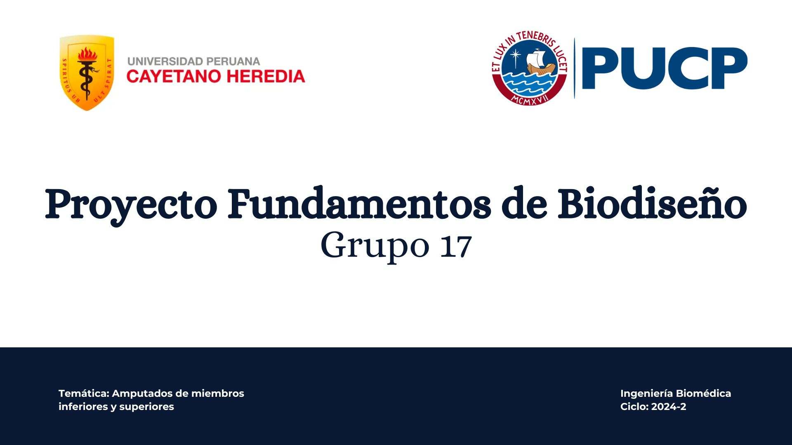

Bienvenidos al repositorio del Grupo 17 del curso: "Fundamentos de Biodiseño". En este espacio recopilaremos nuestra investigación orientada al desarrollo de una propuesta de innovación 
que permita mejorar la calidad de vida y el proceso de rehabilitación de pacientes amputados de miembros superiores e inferiores.

## Tabla de contenidos
- [Temática del proyecto](https://github.com/micaelaacc/Proyecto_FunBio#tem%C3%A1tica-del-proyecto)
- [Nuestro equipo](https://github.com/micaelaacc/Proyecto_FunBio/blob/main/README.md#nuestro-equipo)
- [Entregables](https://github.com/micaelaacc/Proyecto_FunBio/blob/main/README.md#entregables)
- [Bibliografía]

## Temática del proyecto

## Nuestro equipo
- Micaela Alejandra Caro Córdova
- Laura Sofía Diaz Cobba
- Juan Jose Correa Arrieta
- Gustavo Gabriel Quispe Arbieto
- Renzo Fernandez Martinez

## Entregables

## Bibliografía

